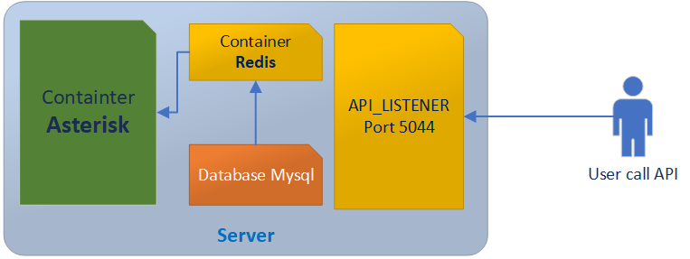

# Asterisk CallerID Management System with Redis

This project implements a high-performance CallerID management system for Asterisk PBX using Redis as the primary data store. Instead of loading CallerID information directly from the database for each call (which can cause performance issues and database overload), the system leverages Redis's in-memory capabilities to provide ultra-fast CallerID lookups with minimal database impact.

## System Architecture



The system consists of the following components:

1. **Asterisk PBX**: Handles call routing and loads CallerID from Redis via AGI scripts
2. **Redis**: Primary data store for CallerID information, providing sub-millisecond response times
3. **MySQL**: Backup database for CallerID data, synchronized periodically
4. **API Listener**: REST API service for CallerID management

## Performance Benefits

The system's architecture provides significant performance advantages over traditional database-driven approaches:

1. **Ultra-Fast Response Times**
   - Redis provides sub-millisecond response times for CallerID lookups
   - No database connection overhead for each call
   - In-memory operations eliminate disk I/O latency

2. **Reduced Database Load**
   - Database is only accessed during synchronization
   - No direct database queries during call processing
   - Prevents database overload during high call volumes

3. **Scalability**
   - Redis can handle thousands of concurrent lookups
   - Database load remains constant regardless of call volume
   - Easy horizontal scaling of Redis instances

## CallerID Loading Process

The core functionality of this system is the high-performance loading of CallerID information from Redis for each call. Here's how it works:

1. When a call is initiated, Asterisk executes the AGI script `agi_set_callerid.py`
2. The AGI script performs an ultra-fast Redis lookup based on:
   - Trunk information
   - Route number
   - Call type (manual/auto)
3. Redis returns the CallerID information in sub-millisecond time
4. Asterisk applies the CallerID to the call
5. The call proceeds with the dynamically loaded CallerID

This process is defined in the dialplan (`extensions.conf`):
```asterisk
[default]
exten =>_9.,1,AGI(/data/agi_set_callerid.py)
   same=> n,Noop(${route_number})
   same=> n,Set(Autos=${CUT(CDR(UNIQUEID),#,1)})
   same => n,GotoIf($["${Autos}"== "AT"]?auto_call)
   same=> n(empty_callerid),Set(CALLERID(all)=MN_${src_number}#${TRUNK_NAME}#${route_number}#${new_cid_number}###123#${CDR(UNIQUEID)})
   same=> n,MixMonitor(${STRFTIME(${EPOCH},,%Y-%m-%d)}/${CDR(UNIQUEID)}.gsm)
   same=> n,Dial(PJSIP/9${route_number}${EXTEN:1}@kamailio,40,TtG)
```

## Components

### 1. Asterisk Configuration
- `extensions.conf`: Dialplan configuration that triggers high-performance CallerID loading via AGI
- `agi-bin/`: Directory containing AGI scripts for CallerID management
  - `agi_set_callerid.py`: Main script that performs ultra-fast Redis lookups

### 2. Redis Operations
- `redis_OPS/redis_OPS.py`: Core Redis operations for high-performance CallerID management
  - `add_callerid_to_redis()`: Add new CallerID to Redis with atomic operations
  - `add_callerid_default_redis()`: Set default CallerID with immediate availability
  - `del_pstn_callerid_all_by_trunk()`: Delete all CallerIDs for a trunk with atomic operations

### 3. API Listener
- `API_Auto_LISTENER_redis.py`: REST API service providing endpoints for:
  - CallerID management with Redis-first approach
  - Database synchronization during low-traffic periods
  - CallerID replacement with immediate Redis updates

### 4. Configuration
- `conf/OPS.conf`: Main configuration file containing:
  - MySQL connection settings (for backup/sync only)
  - Redis connection settings (for primary operations)
  - API endpoints
  - System parameters

## Docker Deployment

The system can be deployed using Docker Compose with the following services:

1. **MySQL**: Backup database service
   - Port: 3306
   - Database: asterisk
   - User: asterisk_user
   - Password: asterisk_pass

2. **Redis**: Primary data store service
   - Port: 6379
   - Persistence: Enabled
   - Memory optimization: Enabled

3. **Asterisk**: PBX service
   - Ports: 
     - 5060/udp (SIP)
     - 8088 (ARI)
     - 5038 (AMI)
     - 10000-20000/udp (RTP)
   - Volumes:
     - extensions.conf
     - AGI scripts
     - Recordings

4. **API Listener**: REST API service
   - Ports:
     - 5044 (Main API)
     - 5045 (Click2Call)
     - 5050 (Automation)
   - Volumes:
     - Configuration files
     - Source code

## Getting Started

1. Clone the repository
2. Configure `conf/OPS.conf` with your settings
3. Build and start containers:
   ```bash
   cd docker
   docker-compose up -d
   ```

## API Endpoints

### CallerID Management
- `POST /api/callerid/delete`: Delete all CallerIDs for a trunk (Redis-first operation)
- `POST /api/callerid/sync`: Synchronize CallerIDs from database (low-priority operation)
- `POST /api/callerid/replace`: Replace CallerID for a trunk (Redis-first operation)

## Monitoring

The system provides monitoring capabilities through:
- Asterisk logs
- Redis performance metrics
- API access logs
- Call recordings

## Troubleshooting

Common issues and solutions:
1. CallerID not updating: Check Redis connection and AGI script
2. Database sync issues: Verify MySQL connection and permissions
3. API errors: Check API logs and configuration

## Contributing

1. Fork the repository
2. Create a feature branch
3. Commit your changes
4. Push to the branch
5. Create a Pull Request

## License

This project is licensed under the MIT License - see the LICENSE file for details. 